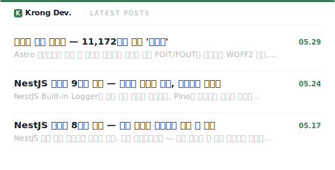

  

  

    
  

 

  <a href="./README.md">English</a>
  ·
  <a href="./docs/README.ko.md">한국어</a>
  ·
  <a href="./docs/README.jp.md">日本語</a>
  ·
  <a href="./docs/README.cn.md">繁體中文</a>

 

## 📝 RECENT POSTS

<h1 align="left">🧑‍💻 ABOUT ME.</h1>

> ### Info

|    Period    | Career |                           Details                           |                  Link                   |
| :----------: | :----: | :---------------------------------------------------------: | :-------------------------------------: |
| 2021.03.02 ~ | `UNIV` | Seokyeong University, Computer Engineering Major (3rd year) | [skuniv](https://www.skuniv.ac.kr/main) |
| 2025.03.14 ~ 2025.08.26 | `CLUB` | UMC 8th Web Developer Challenger | [umc.makeus.in](https://umc.makeus.in/) |
| 2025.09.02 ~ 2025.02.20 | `CLUB` | UMC 9th Web Developer Campus Web Department Lead | [umc.makeus.in](https://umc.makeus.in/) |
| 2026.03.16 | `CAMP` | kt cloud TECH-UP frontend 2nd | [kt cloud TECH-UP](https://ktcloud-techup.com/frontend/) |

> ### Project

|         Period          |            Name            |                            Repo                            |
| :---------------------: | :------------------------: | :--------------------------------------------------------: |
| 2025.07.09 ~ 2025.07.11 |          `HobbySeeker`       |  [HobbySeeker](https://github.com/seongmin36/HobbySeeker.git)   |
| 2025.06.30 ~ 2025.08.23 |         `CHICCHIC`         |     [CHICCHIC](https://github.com/UMC-CHICCHIC/FE.git)     |
| 2025.09.18 ~ 2025.09.19 |           `Duri`           |   [Duri](https://github.com/Hackathon-SKU/frontend.git)    |
| 2025.09.21 ~ 2025.12.14 |           `Re:Fit`           |   [Re:Fit](https://github.com/refit-lab/refit-lab-fe)    |
| 2025.12.28 ~ 2026.02.20 |           `Travlocks`           |   [Travlocks](https://github.com/Travlocks/travlocks-web)    |

 

## 🛠 LANGS & TOOLS

  
  
  
  
  
   
  
  
  

  

## 🔥 STATS

    
   
  

  

<h1 align=left>🔗 CONTACT.</h1>

  
  
  
  

