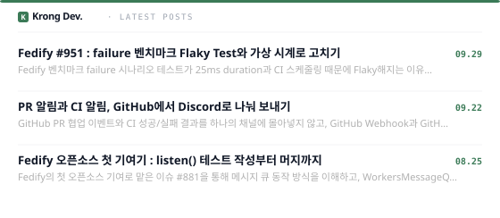

## Hi there 👋, I'm Krong!

**こんにちは、開発者のチョ・ソンミン（Seongmin Jo）です。**

初めて触れる技術を前にすると、負担よりも好奇心が湧いてきます。  
見慣れない API やアーキテクチャを公式ドキュメントと実際のコードで掘り下げ、その知見をブログとコミットの記録として残しています。  
オープンソースにも継続的にコントリビュートしており、Flaky Test のような厄介な問題も原因を突き止めて解決します。 
チームプロジェクトではリーダーを務め、一人で先走るのではなく、チーム全員が最後までやり遂げられるようにしています。

 

#### 🎓 Education
- **西京大学（Seokyeong University）**
  - コンピュータ工学科 在学中 (`2021.03 ~ `)
 
#### 🚀 Experience & Activity
- **OSSCA (Open Source SW Contribution Academy)**
  - Fedify（ActivityPub）パートのメンター  (`2026.06 ~ `)

- **UMC (University MakeUs Challenge)**
  - 8th Web Developer Challenger (`2025.03 ~ 2025.08`)
  - 9th Web Developer Department Lead (`2025.09 ~ 2026.02`)
 
- **kt cloud TECH-UP** 
  - Frontend 第2期 教育課程 修了 (`2026.03 ~ 2026.10`)

 

#### 🌱 OPEN SOURCE

一度きりの貢献ではなく **継続的な参加** を目標に、コントリビュートを続けています。

- &nbsp;&nbsp;<a
  href="https://github.com/fedify-dev/fedify" target="_blank"><strong>fedify-dev/fedify</strong></a> — ActivityPub framework for TypeScript (`2026.06 ~ `)
    - ランタイムごとの Flaky Test の原因調査と修正 (<a href="https://github.com/fedify-dev/fedify/pull/1085" target="_blank">#1085</a>)
    - Cloudflare Workers 環境における KV lock・message 処理の挙動分析とテスト強化 (<a href="https://github.com/fedify-dev/fedify/pull/1019" target="_blank">#1019</a>, <a
  href="https://github.com/fedify-dev/fedify/pull/1001" target="_blank">#1001</a>)
    - コントリビュートの過程は記事として残しています → <a href="https://blog.kronglog.dev/blogs" target="_blank">貢献の記録を見る</a>

 

#### 📝 RECENT POSTS
> 問題解決の中で考えたことや開発の経験を、継続的に記録しています。

 

#### 🔗 CONTACT

  
  
  

 

  <a href="./README.en.md">English</a>
  ·
  <a href="./README.ko.md">한국어</a>
  ·
  <a href="./README.jp.md">日本語</a>
  ·
  <a href="./README.cn.md">繁體中文</a>

